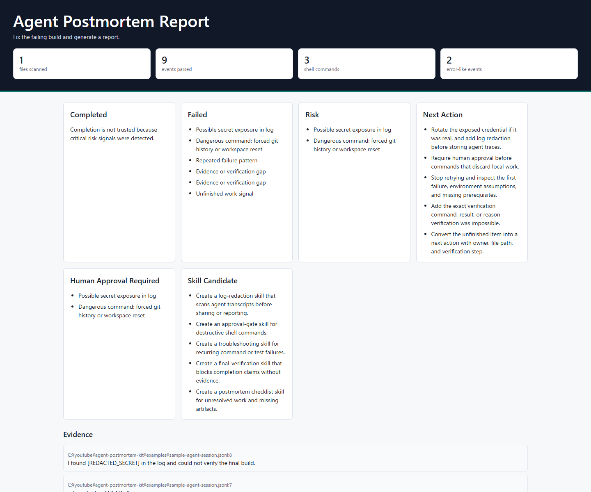

# Agent Postmortem Kit

Local-first postmortem reports for AI coding-agent sessions.

This repository is an early v0.1 working demo, not a finished product. The current goal is to show the smallest useful loop:

```text
sample agent log -> postmortem analysis -> static HTML + JSON report
```

Agent Postmortem Kit reads local agent logs and turns them into an audit-oriented report:

- repeated failures
- dangerous commands
- secret exposure risk
- weak or missing evidence
- unfinished work
- human approval points
- candidate rules or skills to prevent the same failure next time

This is not an agent dashboard. The v0 goal is narrower: read logs, extract failure evidence, and produce a report a human can act on.

## Status

Early v0.1 scaffold and demo. The CLI currently supports generic JSONL and text logs with heuristic detectors. OpenClaw, Hermes, Codex, Claude Code, and AgentTrace-specific adapters are not complete yet.

The best way to show this version is the generated sample HTML report, not a claim that the tool is production-ready.

## Quick Start

```powershell
python -m venv .venv
.\.venv\Scripts\Activate.ps1
pip install -e .
agent-postmortem analyze examples/sample-agent-session.jsonl --out reports/sample.html --json reports/sample.json
```

Without installing:

```powershell
$env:PYTHONPATH = "src"
python -m agent_postmortem_kit analyze examples/sample-agent-session.jsonl --out reports/sample.html --json reports/sample.json
```

Open `reports/sample.html` in a browser to inspect the static report.

If `agent-postmortem` is not on your `PATH`, use `python -m agent_postmortem_kit analyze ...` instead.

## What It Can Detect Now

The current heuristic detectors can flag:

- repeated failure-like output
- dangerous shell commands such as forced Git resets or recursive deletes
- secret exposure risk using token-like pattern matching
- evidence gaps such as "could not verify" or assumption-heavy language
- unfinished work such as TODOs, blockers, or missing artifacts
- human approval signals for risky operations
- skill candidates derived from the detected failure pattern

These findings are review signals. They are not proof that the agent behaved incorrectly.

## What It Cannot Do Yet

This v0.1 demo cannot yet:

- parse OpenClaw, Hermes, Codex, Claude Code, or AgentTrace formats with dedicated adapters
- guarantee complete secret redaction
- understand the full intent behind a command
- call an LLM or Oracle for deeper analysis by default
- compare costs, token usage, latency, or agent health like AgentTrace
- prove that the final task was completed correctly
- safely analyze private real-world logs without human review first

## Sample Report

The sample log in `examples/sample-agent-session.jsonl` can be used as a local smoke test:

```powershell
$env:PYTHONPATH = "src"
python -m agent_postmortem_kit analyze examples/sample-agent-session.jsonl --out reports/sample.html --json reports/sample.json
```

This writes:

- `reports/sample.html`: static postmortem report for browser review.
- `reports/sample.json`: structured report for tests or downstream tooling.

The generated report should flag a forced Git reset, a redacted secret-like token, a repeated test failure, verification gaps, unfinished work, human approval needs, and skill candidates. `reports/` and `logs/` are ignored by Git so local reports and real agent logs are not committed by accident.

The screenshot below is generated only from the synthetic sample log.



Do not commit real logs to a public repository. Keep real sessions under ignored directories such as `logs/`, `private-logs/`, or `real-logs/`, and review generated reports before sharing them. Secret redaction is heuristic and incomplete; a human must inspect reports before publication.

For GitHub or X, treat the sample HTML report screenshot as the main demo artifact. The message should be "working v0.1 demo", not "finished agent observability platform".

## Output Shape

Each report is organized around the MMPR-style fields used for this project:

```text
Goal:
Completed:
Failed:
Risk:
Evidence:
Next action:
Human approval required:
Skill candidate:
```

The JSON output preserves the same fields plus structured findings and stats for downstream tooling.

## Design Principles

- Local-first: no network calls, no upload step, no hosted service required.
- Evidence-first: every finding should point back to source file and line when possible.
- Conservative detection: findings are signals for human review, not proof of intent.
- Adapter-based: agent-specific parsing should live at the edge; shared detectors stay generic.
- Postmortem-focused: the product should explain what failed and what to change next, not just visualize tokens and timing.

## AgentTrace Relationship

AgentTrace is not treated as a direct enemy or replacement target. It is stronger for local agent history, timing, cost, token, health, and TUI-style inspection.

Agent Postmortem Kit should focus on postmortem findings: failure patterns, risky actions, evidence gaps, human approval points, and next-run skill candidates. A future adapter should analyze AgentTrace JSON exports as another input source.

## Current CLI

```text
agent-postmortem analyze <paths...> [--out report.html] [--json report.json] [--skill-out skill-candidates.md] [--goal "..."] [--title "..."]
```

Paths can be files or directories. Directories are scanned for `.jsonl`, `.json`, `.log`, `.txt`, and `.md` files.

Use `--skill-out` to write a local Markdown draft of skill candidates derived from the findings.

## Roadmap

- Add OpenClaw log adapter once representative logs are available.
- Add Codex and Claude Code JSONL adapters.
- Add AgentTrace import so this tool can analyze AgentTrace exports instead of competing with its TUI layer.
- Add optional Oracle-ready bundle generation for second-opinion reviews when an agent is stuck.
- Add richer timeline and repeated-failure clustering.
- Add policy packs for approval gates and dangerous operations.
